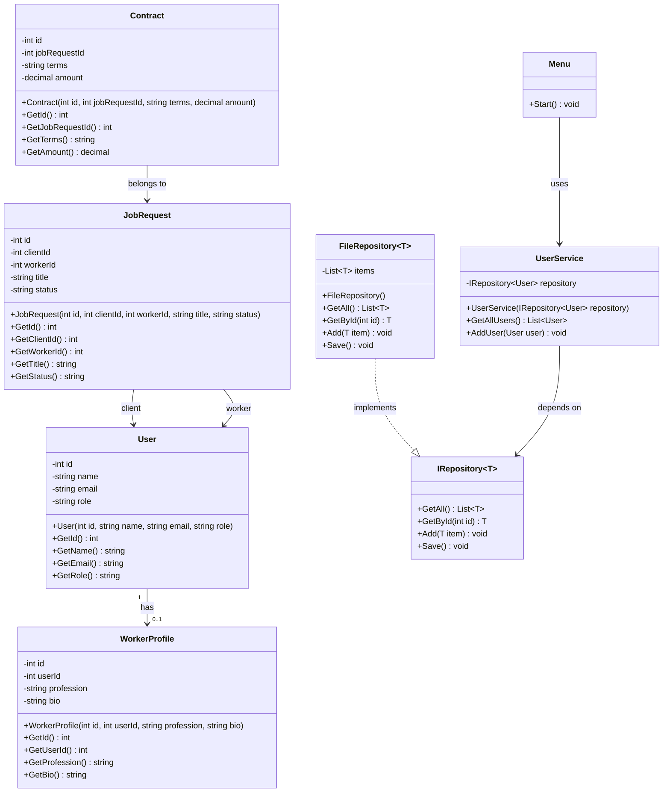

# Punaflow UML Class Diagram

## Overview
This diagram presents the main classes of the Punaflow project, including their attributes, methods, and relationships.

---

## Classes

### User
- id : int
- name : string
- email : string
- role : string

+ User(int id, string name, string email, string role)
+ GetId() : int
+ GetName() : string
+ GetEmail() : string
+ GetRole() : string

---

### WorkerProfile
- id : int
- userId : int
- profession : string
- bio : string

+ WorkerProfile(int id, int userId, string profession, string bio)
+ GetId() : int
+ GetUserId() : int
+ GetProfession() : string
+ GetBio() : string

---

### JobRequest
- id : int
- clientId : int
- workerId : int
- title : string
- status : string

+ JobRequest(int id, int clientId, int workerId, string title, string status)
+ GetId() : int
+ GetClientId() : int
+ GetWorkerId() : int
+ GetTitle() : string
+ GetStatus() : string

---

### Contract
- id : int
- jobRequestId : int
- terms : string
- amount : decimal

+ Contract(int id, int jobRequestId, string terms, decimal amount)
+ GetId() : int
+ GetJobRequestId() : int
+ GetTerms() : string
+ GetAmount() : decimal

---

### IRepository<T>
+ GetAll() : List<T>
+ GetById(int id) : T
+ Add(T item) : void
+ Save() : void

---

### FileRepository<T>
- items : List<T>

+ FileRepository()
+ GetAll() : List<T>
+ GetById(int id) : T
+ Add(T item) : void
+ Save() : void

---

### UserService
- repository : IRepository<User>

+ UserService(IRepository<User> repository)
+ GetAllUsers() : List<User>
+ AddUser(User user) : void

---

### Menu
+ Start() : void

---

## Relationships
- A **User** can have one **WorkerProfile**
- A **JobRequest** connects a client with a worker
- A **Contract** belongs to one **JobRequest**
- **FileRepository<T>** implements **IRepository<T>**
- **UserService** depends on **IRepository<User>**
- **Menu** uses **UserService**

---

## Mermaid Diagram

